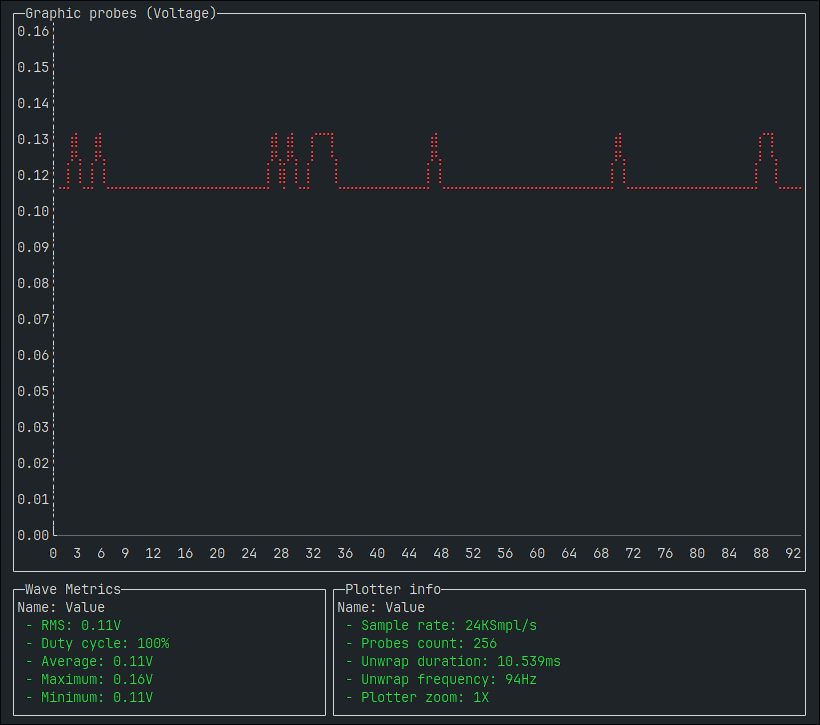

# Oscyllo-tool

Self use oscilloscope project on [LOLIN(WEMOS) D1 R2 & mini](https://iotappstory.com/hardware/ESP8266/boards/lolinwemos-d1-r2-mini)
Monitoring programm.

**Interface**

## License

[MIT](https://choosealicense.com/licenses/mit/)

